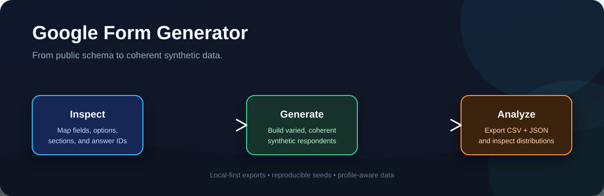
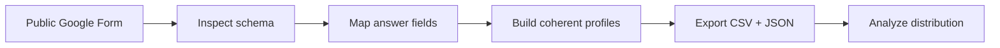

<div align="center">



# Google Form Generator

### Synthetic survey data for realistic, analysis-ready coursework prototypes.

[](https://www.python.org/)
[](https://github.com/shreyanshucodes/google-form-generator/actions)
[](LICENSE)

</div>

Google Form Generator reads a public Google Form, maps its answer fields, and
creates internally consistent synthetic responses as CSV and JSON. It is built
for data-science practice, prototypes, and authorized testing workflows where
you need useful data before you have real survey responses.

## Why It Exists

Most form generators stop at random choices. This project aims for data that is
more useful to analyze:

- Unique identities when a form asks for names or email addresses
- Coherent demographic profiles such as age and occupation
- Store-operation profiles where staffing, delivery volume, radius, and channel
  relate to one another
- CSR survey profiles where awareness influences later perception questions
- Natural short-form answers for open text fields

## Quick Start

```powershell
git clone https://github.com/shreyanshucodes/google-form-generator.git
cd google-form-generator
python -m venv .venv
.venv\Scripts\activate
pip install -r requirements.txt
```

Inspect a form before generating data:

```powershell
python main.py "https://docs.google.com/forms/d/e/FORM_ID/viewform" --inspect-only
```

Generate a reproducible dataset:

```powershell
python main.py "FORM_URL" --count 100 --seed 20260920 --output output/responses.csv
```

Analyze it immediately:

```powershell
python analyze.py output/responses.csv
```

## Workflow



The default flow is local only. `--submit` is intentionally opt-in and should
only be used for forms you own or are explicitly authorized to test.

## What It Handles

| Capability | Detail |
| --- | --- |
| Modern form schemas | Reads Google Forms' embedded `FB_PUBLIC_LOAD_DATA_` schema. |
| Correct field mapping | Uses the form's answer-entry IDs rather than display IDs. |
| Unicode answer values | Preserves exact values such as `₹` and typographic dashes. |
| Multi-page forms | Builds the page history expected by sectioned forms. |
| Common input types | Text, textarea, email, date, select, radio, checkbox, and scales. |
| Reproducible output | Use `--seed` to recreate the same dataset. |
| Data exports | Writes analysis-friendly CSV plus source-preserving JSON. |

## Survey Profiles

The generator recognizes several common contexts and uses linked choices rather
than independent random fields.

| Profile | Example relationships |
| --- | --- |
| Demographic | Younger respondents are more likely to be students; names are unique within a batch. |
| Local-store operations | Larger stores tend to have more staff, broader delivery radius, and higher delivery volume. |
| CSR perception | Awareness of an organization influences familiarity and later perception responses. |

For unfamiliar forms, the project falls back to a general synthetic response
strategy. Add a small profile function in `generator.py` when a specific survey
needs stronger domain logic.

## Example Commands

```powershell
# Generate 35 responses for a CSR survey
python main.py "FORM_URL" --count 35 --seed 20260920 --output output/csr_survey.csv

# Create a different, still reproducible dataset
python main.py "FORM_URL" --count 47 --seed 9173 --output output/store_survey.csv

# Preview the available fields only
python main.py "FORM_URL" --inspect-only
```

## Project Structure

```text
.
├── form.py          # Form inspection and schema parsing
├── generator.py     # Profile-aware synthetic response generation
├── main.py          # CLI, export, and authorized submission flow
├── analyze.py       # Quick CSV distribution summary
├── tests/           # Offline behavior checks
├── docs/            # Compatibility and contribution notes
└── assets/          # README visuals
```

## Data Ethics

Generated rows are synthetic. Keep them clearly separated from real survey
responses, label them appropriately in coursework or prototypes, and obtain
permission before submitting data to a live form. The local CSV/JSON workflow
is the recommended default.

## Contributing

Small, well-scoped improvements are welcome. See [CONTRIBUTING.md](CONTRIBUTING.md)
for the project conventions and [docs/compatibility.md](docs/compatibility.md)
for the Google Forms behavior this project supports.

## License

Released under the [MIT License](LICENSE).
